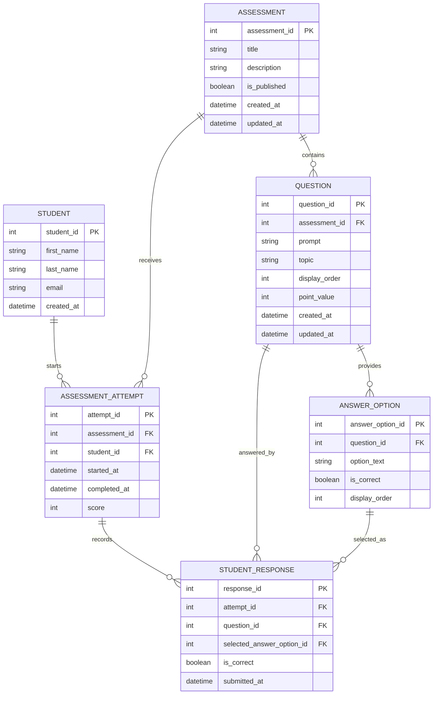

# Entity Relationship Diagram

This ERD models the data structure for a multiple-choice assessment tool that can present questions, store answer options, accept student submissions, validate correctness, and calculate a one-point-per-question score.

## Notes

- `ASSESSMENT` owns the set of `QUESTION` records.
- `QUESTION` owns the available `ANSWER_OPTION` records, including which option is correct.
- `ASSESSMENT_ATTEMPT` represents one student's run through one assessment.
- `STUDENT_RESPONSE` stores each submitted answer and the validation result at submission time.
- `score` can be calculated from correct responses, but storing it on `ASSESSMENT_ATTEMPT` makes completed-result reads simple.
